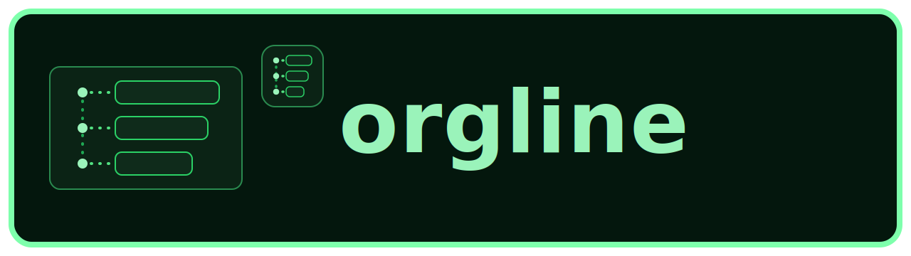

#  orgline

<p align="center">
  
</p>

<p align="center">
  An outliner with a clean web interface, shipped as a single binary.
</p>

<p align="center">
  Built with <strong>plain Go + plain JavaScript</strong>, embedded frontend assets, and SQLite.
</p>

<p align="center">
  
  
  
  
</p>

## Demo

- Local-only demo (no backend required): <https://sri.github.io/orgline/index.html>

## Why orgline

- Fast hierarchical outlining with keyboard-first workflows.
- Collapsible tree with persisted open/closed state.
- Inline editing with contenteditable and server persistence.
- Single-binary deployment (frontend embedded with `go:embed`).

## Tech Stack

- Go `1.26` (standard library-first backend)
- Plain JavaScript (`internal/frontend/static/index.html`) for the UI
- SQLite 3 (via `modernc.org/sqlite`)
- In-house SQL migration runner (`internal/db/migrate`)

## Quick Start

```bash
just dev
```

Then open <http://localhost:8080>.

## Commands

- `just dev`: run dev supervisor (watch + restart + browser auto-reload support)
- `just loadtest`: run dev with `Shakespeare.db`
- `just prod`: build `./bin/orgline` (single deployable binary)

## Feature Highlights

- Outline model: `uuid`, `created_at`, `updated_at`, `body`, ordered children, `is_open`, `is_favorite`.
- Tree controls: expand all, collapse all, expand one more level.
- Zoom mode per item (`?item_id=<uuid>`) with back-to-all and go-to-parent links.
- Favorites:
  - per-item toggle via heart in item tools
  - top-bar favorites filter
- Search:
  - client-side filtering after minimum query length
  - match highlighting in item body
  - temporary path expansion to show matching lineage
- Selection and editing:
  - drag selection across rows
  - Shift+Up / Shift+Down range selection
  - multi-select delete/tab operations
  - in-memory undo stack (including multi-item delete restore)
- Local mode for static demo use without backend API calls.
- Theme system with runtime switcher:
  - `default`, `dark`, `matrix`, `ocean`, `solar`, `graphite`
  - persisted in `localStorage` key `orgline-theme`

## Keyboard and Mouse

- `Enter`: create new item (context-aware sibling/child behavior)
- `Shift+Enter`: newline in current item
- `Tab`: indent
- `Shift+Tab`: outdent
- `Backspace` / `Delete` on empty item: delete item
- `ArrowUp` / `ArrowDown`: navigate visible items
- `Shift+ArrowUp` / `Shift+ArrowDown`: grow/shrink range selection

## API Endpoints

- `GET /api/hello`
- `GET /api/items`
- `POST /api/items`
- `POST /api/items/{uuid}/child`
- `PATCH /api/items/{uuid}`
- `DELETE /api/items/{uuid}`
- `PATCH /api/items/{uuid}/open-state`
- `PATCH /api/items/{uuid}/favorite-state`
- `POST /api/items/{uuid}/enter`
- `POST /api/items/{uuid}/indent`
- `POST /api/items/{uuid}/outdent`
- `POST /api/items/{uuid}/move`
- `GET /api/dev/build` (dev mode only)

## Runtime Configuration

Flags (with matching env vars):

- `-port` (`ORGLINE_PORT`) default `8080`
- `-addr` (`ORGLINE_ADDR`) full listen address (overrides `-port`)
- `-db-path` (`ORGLINE_DB_PATH`) default `orgline.db`
- `-read-header-timeout` (`ORGLINE_READ_HEADER_TIMEOUT`) default `5s`
- `-read-timeout` (`ORGLINE_READ_TIMEOUT`) default `15s`
- `-write-timeout` (`ORGLINE_WRITE_TIMEOUT`) default `15s`
- `-idle-timeout` (`ORGLINE_IDLE_TIMEOUT`) default `60s`

Example:

```bash
./bin/orgline -port 9090 -db-path /var/lib/orgline/orgline.db
```

## Security Summary

- `orgline` currently has no built-in login, authentication, or authorization.
- Run it on `localhost` for personal use, or behind a protected private network.
- Do not expose it directly to the public internet without adding your own auth and network controls.

## Screenshots

### Dark Theme Workspace


### Matrix Theme Workspace


