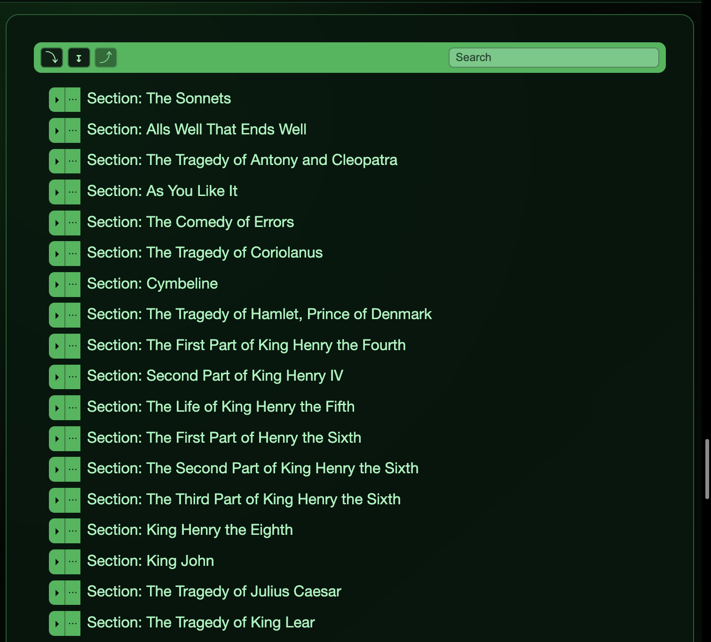
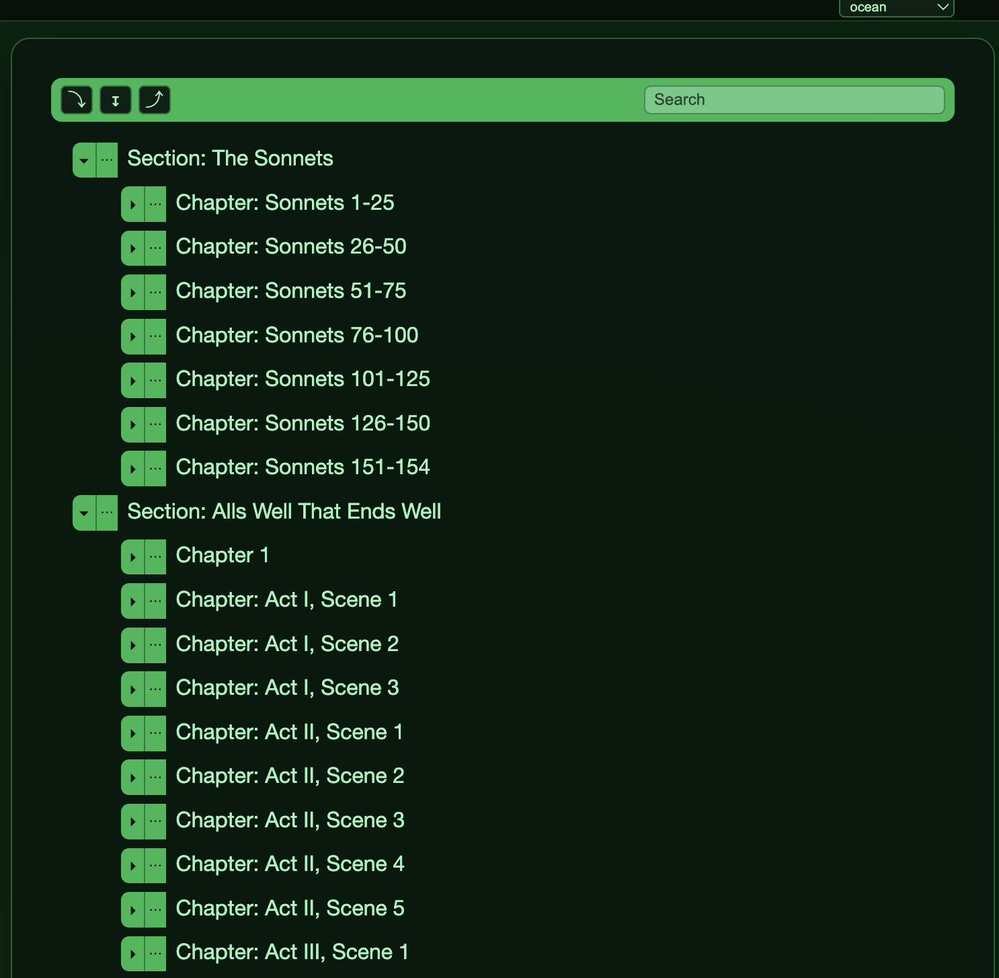

# orgline

Outliner built with Go and plain JavaScript.

## Demo

- Local-only demo (no backend required): https://sri.github.io/orgline/index.html?local=true

## Tech Stack

- Go `1.26` (standard library-first backend)
- Plain JavaScript (`internal/frontend/static/index.html`) for all UI behavior
- SQLite 3 (via `modernc.org/sqlite`)
- Single-binary deployment using `go:embed` for frontend assets
- In-house SQL migration runner (`internal/db/migrate`)

## Features

- Hierarchical outline data model: `uuid`, `created_at`, `updated_at`, `body`, parent/child relationship, ordered children, persisted `is_open`.
- Item rendering at `/` with recursive tree UI.
- Inline editing with `contenteditable`; saves item body on blur.
- Keyboard behaviors:
  - `Enter`: create next sibling, or first child when current item has children.
  - `Shift+Enter`: insert newline while staying in edit mode.
  - `Tab`: indent item under previous sibling.
  - `Shift+Tab`: outdent item to become next sibling of current parent.
  - `Backspace` on empty item: delete item.
  - `ArrowUp` / `ArrowDown`: move focus to nearest previous/next visible item.
- Per-item open/close toggle with server-persisted state (`is_open` survives reload).
- Item controls menu with `Zoom` action:
  - Zoom to subtree (`?item_id=<uuid>` in URL).
  - `Back to all items` and `Go to parent` links in zoom mode.
- Search in top toolbar:
  - Client-side filtering with highlighted matches.
  - Shows full matching item body.
  - Temporarily opens matching path (parents/grandparents).
  - Restores previous open/closed state when search clears.
- Top toolbar actions (next to search):
  - `⤵` Expand all visible items.
  - `↧` Expand one more visible level progressively per click.
  - `⤴` Collapse all visible items.
- Theme system with runtime switching:
  - `default`, `dark`, `matrix`, `ocean`, `solar`, `graphite`
  - Stored in `localStorage` (`orgline-theme`)
- Unsaved edit warning on tab/window close.
- Dev auto-reload support through `/api/dev/build`.
- Optional Shakespeare load-test database (`Shakespeare.db`) and dev target.

## API Endpoints

- `GET /api/hello`
- `GET /api/items`
- `PATCH /api/items/{uuid}`
- `DELETE /api/items/{uuid}`
- `PATCH /api/items/{uuid}/open-state`
- `POST /api/items/{uuid}/enter`
- `POST /api/items/{uuid}/indent`
- `POST /api/items/{uuid}/outdent`
- `GET /api/dev/build` (dev mode only)

## Runtime Configuration

Flags (with matching env var defaults):

- `-port` (`ORGLINE_PORT`) default `8080`
- `-addr` (`ORGLINE_ADDR`) full listen address (overrides `-port`)
- `-db-path` (`ORGLINE_DB_PATH`) default `orgline.db`
- `-read-header-timeout` (`ORGLINE_READ_HEADER_TIMEOUT`) default `5s`
- `-read-timeout` (`ORGLINE_READ_TIMEOUT`) default `15s`
- `-write-timeout` (`ORGLINE_WRITE_TIMEOUT`) default `15s`
- `-idle-timeout` (`ORGLINE_IDLE_TIMEOUT`) default `60s`

Examples:

```bash
./bin/orgline -port 9090 -db-path /var/lib/orgline/orgline.db
./bin/orgline -addr 127.0.0.1:8081 -db-path ./orgline.db
ORGLINE_PORT=8082 ORGLINE_DB_PATH=/data/orgline.db ./bin/orgline
```

## Commands

- `just dev` runs the dev supervisor (file watching + restart + browser auto-reload support).
- `just dev-loadtest` runs dev mode with `Shakespeare.db`.
- `just go-dev-loadtest` alias of `dev-loadtest`.
- `just prod` builds `./bin/orgline` (single deployable binary with embedded frontend).
- `just deploy` alias of `prod`.

## Screenshots



